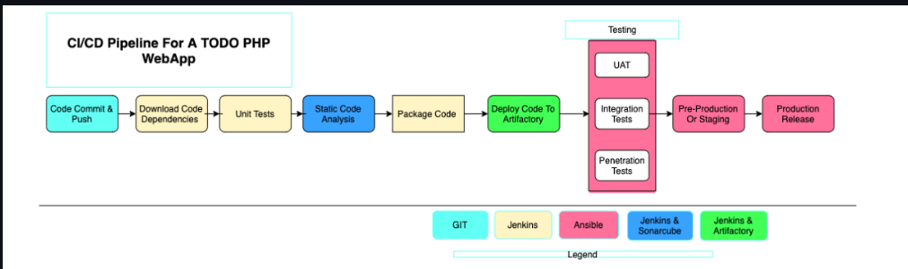
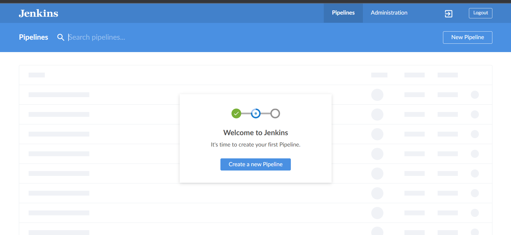
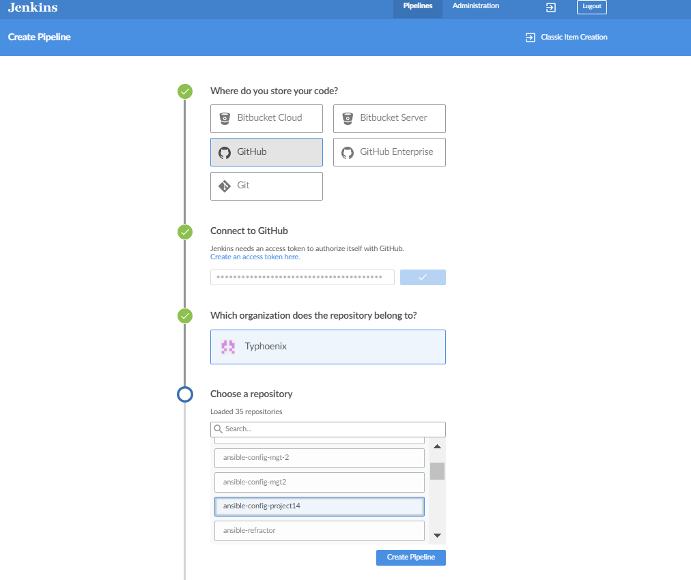
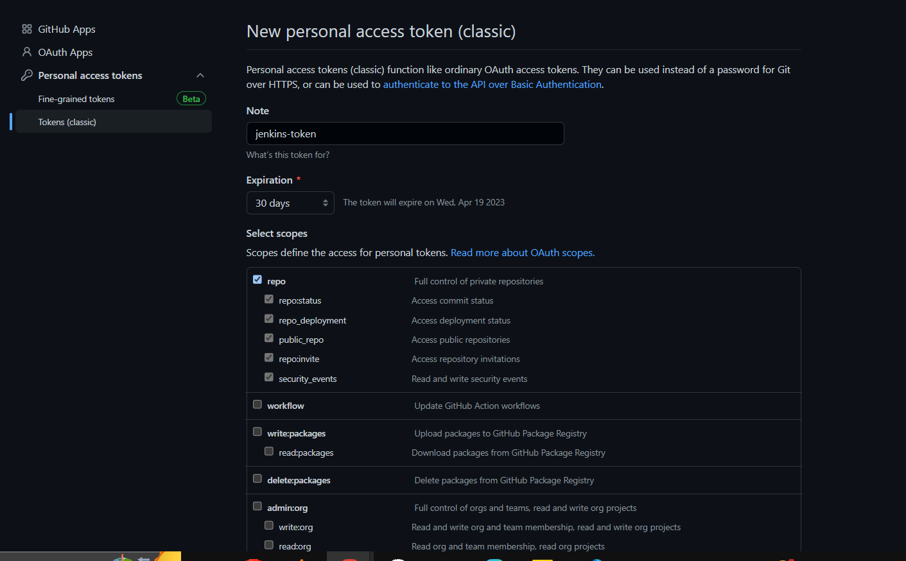
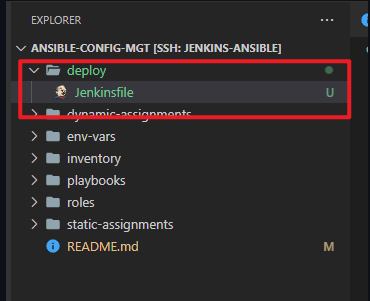
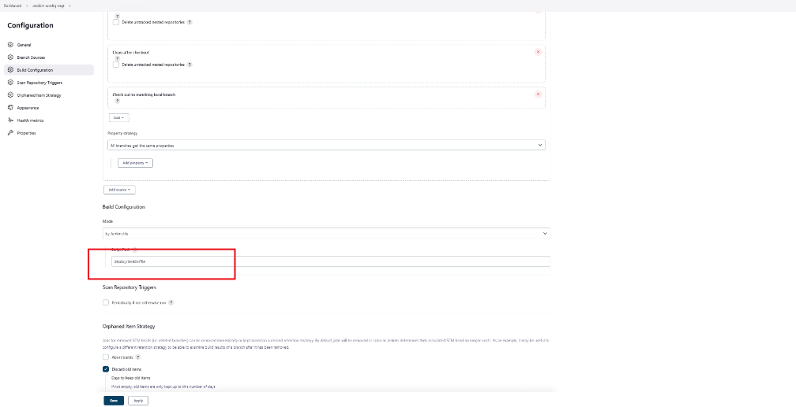
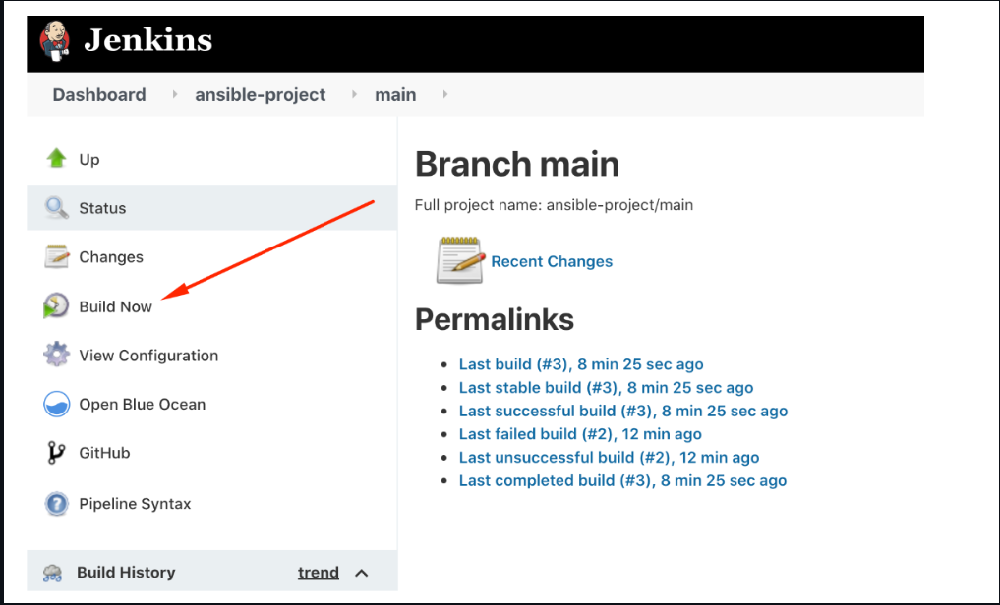
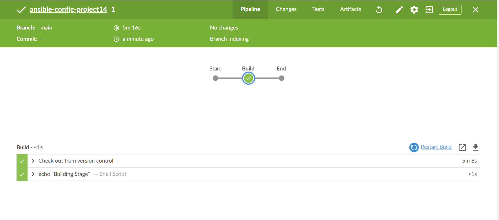
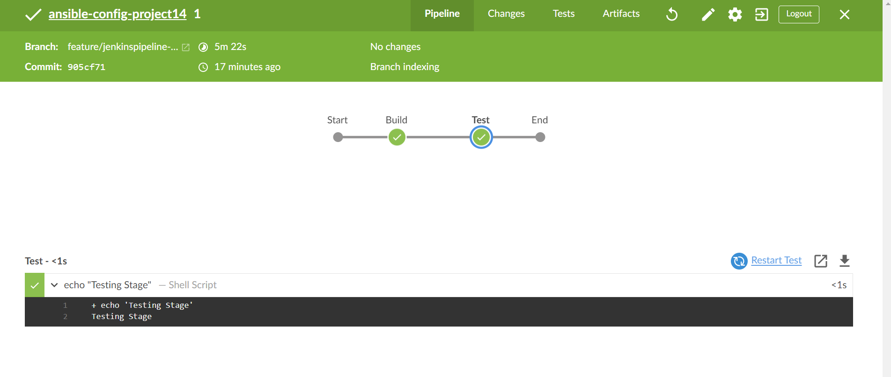
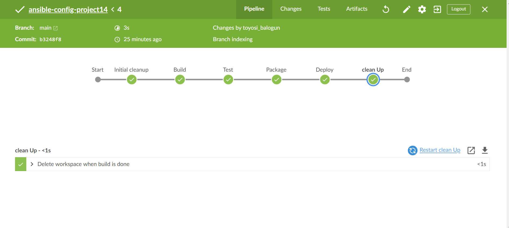

## **EXPERIENCE CONTINUOUS INTEGRATION WITH JENKINS | ANSIBLE | ARTIFACTORY | SONARQUBE | PHP**
===============================================================





## **Project Description:**


In this project, I will be setting up a CI/CD Pipeline for a PHP based application. The overall CI/CD process looks like the architecture above.

This project is architected in two major repositories with each repository containing its own CI/CD pipeline written in a Jenkinsfile

* ansible-config-mgt REPO: this repository contains JenkinsFile which is responsible for setting up and configuring infrastructure required to carry out processes required for our application to run. It does this through the use of ansible roles. This repo is infrastructure specific
  
* PHP-todo REPO : this repository contains jenkinsfile which is focused on processes which are application build specific such as building, linting, static code analysis, push to artifact repository etc.


## **Pre-requisites**

Will be making use of AWS virtual machines for this and will require 6 servers for the project which includes: Nginx Server: This would act as the reverse proxy server to our site and tool.

**Jenkins server:** To be used to implement your CI/CD workflows or pipelines. Select a t2.medium at least, Ubuntu 20.04 and Security group should be open to port 8080

**SonarQube server:** To be used for Code quality analysis. Select a t2.medium at least, Ubuntu 20.04 and Security group should be open to port 9000

**Artifactory server:** To be used as the binary repository where the outcome of your build process is stored. Select a t2.medium at least and Security group should be open to port 8081

**Database server:** To server as the databse server for the Todo application

**Todo webserver:** To host the Todo web application.


Ansible Inventory should look like this

```
├── ci
├── dev
├── pentest
├── pre-prod
├── prod
├── sit
└── uat
```

ci inventory file

```
[jenkins]
<Jenkins-Private-IP-Address>

[nginx]
<Nginx-Private-IP-Address>

[sonarqube]
<SonarQube-Private-IP-Address>

[artifact_repository]
<Artifact_repository-Private-IP-Address>
```

dev Inventory file

```
[tooling]
<Tooling-Web-Server-Private-IP-Address>

[todo]
<Todo-Web-Server-Private-IP-Address>

[nginx]
<Nginx-Private-IP-Address>

[db:vars]
ansible_user=ec2-user
ansible_python_interpreter=/usr/bin/python

[db]
<DB-Server-Private-IP-Address>
```

pentest inventory file

```
[pentest:children]
pentest-todo
pentest-tooling

[pentest-todo]
<Pentest-for-Todo-Private-IP-Address>

[pentest-tooling]
<Pentest-for-Tooling-Private-IP-Address>
```


## **ANSIBLE ROLES FOR CI ENVIRONMENT**

Now we go ahead and Add two more roles to ansible:

1. SonarQube (Scroll down to the Sonarqube section to see instructions on how to set up and configure SonarQube manually)

Why do we need SonarQube?
SonarQube is an open-source platform developed by SonarSource for continuous inspection of code quality, it is used to perform automatic reviews with static analysis of code to detect bugs, code smells, and security vulnerabilities.

2. Artifactory

Artifactory is a product by JFrog that serves as a binary repository manager. The binary repository is a natural extension to the source code repository, in that the outcome of your build process is stored. It can be used for certain other automation, but we will it strictly to manage our build artifacts.


Configuring Ansible For Jenkins Deployment

In previous projects, you have been launching Ansible commands manually from a CLI. Now, with Jenkins, we will start running Ansible from Jenkins UI.

To do this,

1. Navigate to Jenkins URL

2. Install & Open Blue Ocean Jenkins Plugin

3. Create a new pipeline



4. Select Github


(./Images/choose%20repo.PNG)

5. Connect Jenkins with GitHub

6. Login to GitHub & Generate an Access Token

7. Copy Access Token



1. Paste the token and connect

2.  Create a new Pipeline

At this point you may not have a Jenkinsfile in the Ansible repository, so Blue Ocean will attempt to give you some guidance to create one. But we do not need that. We will rather create one ourselves. So, click on Administration to exit the Blue Ocean console.

### **Let us create our Jenkinsfile**

Inside the Ansible project, create a new directory `deploy` and start a new file `Jenkinsfile` inside the directory.

)


Add the code snippet below to start building the `Jenkinsfile` gradually. This pipeline currently has just one stage called Build and the only thing we are doing is using the `shell script` module to echo `Building Stage`

```
pipeline {
    agent any

  stages {
    stage('Build') {
      steps {
        script {
          sh 'echo "Building Stage"'
        }
      }
    }
    }
}
```

Now go back into the Ansible pipeline in Jenkins, and select configure



Back to the pipeline again, this time click "Build now"





This will trigger a build and you will be able to see the effect of our basic `Jenkinsfile` configuration by going through the console output of the build.

To really appreciate and feel the difference of Cloud Blue UI, it is recommended to try triggering the build again from Blue Ocean interface.

1. Click on Blue Ocean

2. Select your project

3. Click on the play button against the branch




Let us see this in action.

1. Create a new git branch and name it `feature/jenkinspipeline-stages`

2. Currently we only have the `Build` stage. Let us add another stage called `Test`. Paste the code snippet below and push the new changes to GitHub.

```
   pipeline {
    agent any

  stages {
    stage('Build') {
      steps {
        script {
          sh 'echo "Building Stage"'
        }
      }
    }

    stage('Test') {
      steps {
        script {
          sh 'echo "Testing Stage"'
        }
      }
    }
    }
}
```

3. To make your new branch show up in Jenkins, we need to tell Jenkins to scan the repository.

4. Navigate to the Ansible project and click on "Scan repository now"

5. Refresh the page and both branches will start building automatically. You can go into Blue Ocean and see both branches there too.

6. In Blue Ocean, you can now see how the Jenkinsfile has caused a new step in the pipeline launch build for the new branch



7. Add more stages into the Jenkins file to simulate below phases. (Just add an echo command like we have in build and test stages)

- Package
- Deploy
- Clean up
  
8. Verify in Blue Ocean that all the stages are working, then merge your feature branch to the main branch



## **RUNNING ANSIBLE PLAYBOOK FROM JENKINS**


Now that you have a broad overview of a typical Jenkins pipeline. Let us get the actual Ansible deployment to work by:

For instructions on installations of the dependencies use the link below:

[here](https://github.com/Tonybesto/ansible-config/blob/main/README.md)

1. Installing Ansible on Jenkins


2. Installing Ansible plugin in Jenkins UI


3. Creating Jenkinsfile from scratch. (Delete all you currently have in there and start all over to get Ansible to run successfully)

```
pipeline {
  agent any

  environment {
      ANSIBLE_CONFIG="${WORKSPACE}/deploy/ansible.cfg"
    }

  parameters {
      string(name: 'inventory', defaultValue: 'dev',  description: 'This is the inventory file for the environment to deploy configuration')
    }

  stages{
      stage("Initial cleanup") {
          steps {
            dir("${WORKSPACE}") {
              deleteDir()
            }
          }
        }

      stage('Checkout SCM') {
         steps{
            git branch: 'main', url: 'https://github.com/Tonybesto/ansible-config.git'
         }
       }

      stage('Prepare Ansible For Execution') {
        steps {
          sh 'echo ${WORKSPACE}' 
          sh 'sed -i "3 a roles_path=${WORKSPACE}/roles" ${WORKSPACE}/deploy/ansible.cfg'  
        }
     }

      stage('Run Ansible playbook') {
        steps {
           ansiblePlaybook become: true, colorized: true, credentialsId: 'private-key', disableHostKeyChecking: true, installation: 'ansible', inventory: 'inventory/${inventory}', playbook: 'playbooks/site.yml'
         }
      }

      stage('Clean Workspace after build'){
        steps{
          cleanWs(cleanWhenAborted: true, cleanWhenFailure: true, cleanWhenNotBuilt: true, cleanWhenUnstable: true, deleteDirs: true)
        }
      }
   }

}
```

Some possible errors to watch out for:

* Ensure that the git module in Jenkinsfile is checking out SCM to main branch instead of master (GitHub has discontinued the use of Master)

* Jenkins needs to export the ANSIBLE_CONFIG environment variable. You can put the .ansible.cfg file alongside Jenkinsfile in the deploy directory. This way, anyone can easily identify that everything in there relates to deployment. Then, using the Pipeline Syntax tool in Ansible, generate the syntax to create environment variables to set. Enter this into the ancible.cfg file

```
[defaults]
roles_path= /home/ec2-user/ansible-config/roles
timeout = 160
callback_whitelist = profile_tasks
log_path=~/ansible.log
host_key_checking = False
gathering = smart
ansible_python_interpreter=/usr/bin/python3
allow_world_readable_tmpfiles=true


[ssh_connection]
ssh_args = -o ControlMaster=auto -o ControlPersist=30m -o ControlPath=/tmp/ansible-ssh-%h-%p-%r -o ServerAliveInterval=60 -o ServerAliveCountMax=60 -o ForwardAgent=yes
```

* Remember that ansible.cfg must be exported to environment variable so that Ansible knows where to find Roles. But because you will possibly run Jenkins from different git branches, the location of Ansible roles will change. Therefore, you must handle this dynamically. You can use Linux Stream Editor sed to update the section roles_path each time there is an execution. You may not have this issue if you run only from the main branch.

* If you push new changes to Git so that Jenkins failure can be fixed. You might observe that your change may sometimes have no effect. Even though your change is the actual fix required. This can be because Jenkins did not download the latest code from GitHub. Ensure that you start the Jenkinsfile with a clean up step to always delete the previous workspace before running a new one. Sometimes you might need to login to the Jenkins Linux server to verify the files in the workspace to confirm that what you are actually expecting is there. Otherwise, you can spend hours trying to figure out why Jenkins is still failing, when you have pushed up possible changes to fix the error.

* Another possible reason for Jenkins failure sometimes, is because you have indicated in the Jenkinsfile to check out the main git branch, and you are running a pipeline from another branch. So, always verify by logging onto the Jenkins box to check the workspace, and run git branch command to confirm that the branch you are expecting is there.

* Parameterizing Jenkinsfile For Ansible Deployment. So far we have been deploying to dev environment, what if we need to deploy to other environments? We will use parameterization so that at the point of execution, the appropriate values are applied. To parameterize Jenkinsfile For Ansible Deployment, Update CI inventory with new servers.

```
[tooling]
<SIT-Tooling-Web-Server-Private-IP-Address>

[todo]
<SIT-Todo-Web-Server-Private-IP-Address>

[nginx]
<SIT-Nginx-Private-IP-Address>

[db:vars]
ansible_user=ec2-user
ansible_python_interpreter=/usr/bin/python

[db]
<SIT-DB-Server-Private-IP-Address>
```


